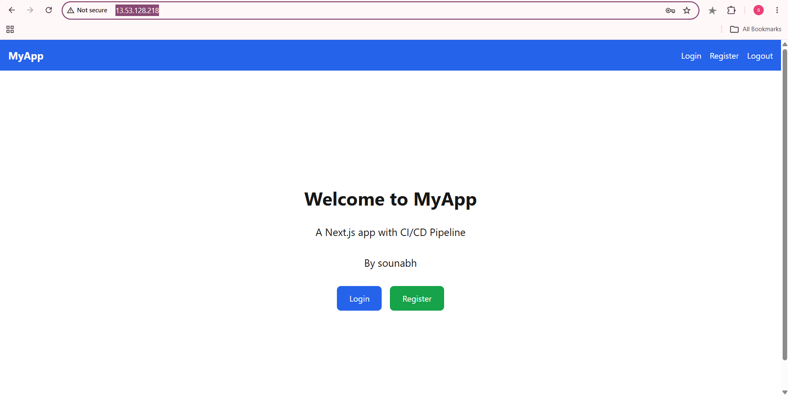
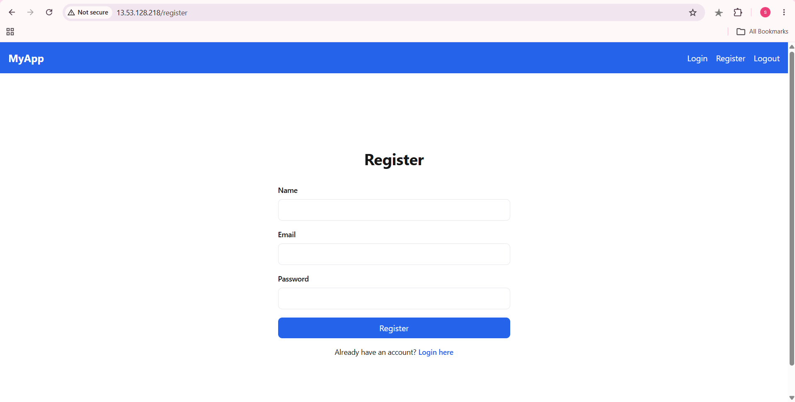
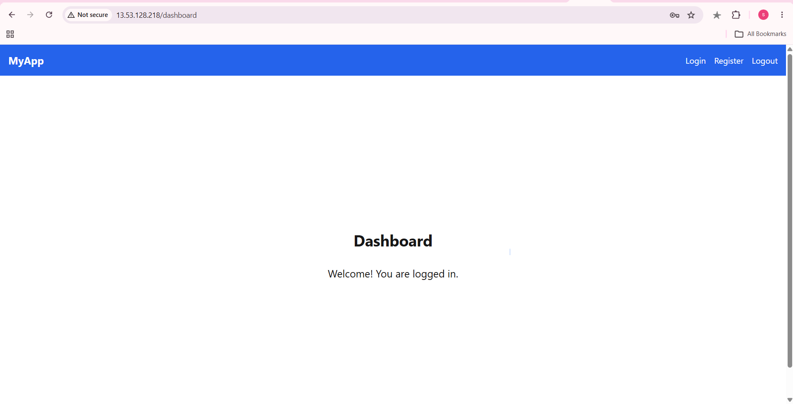
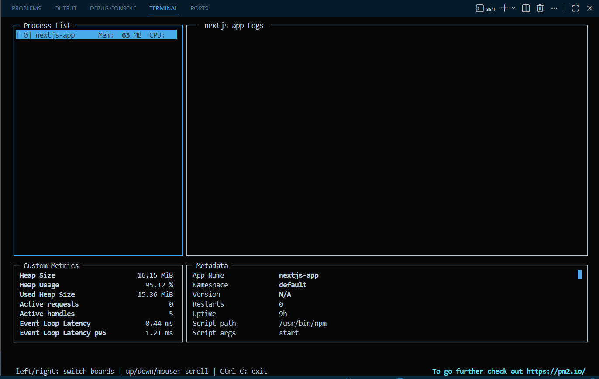
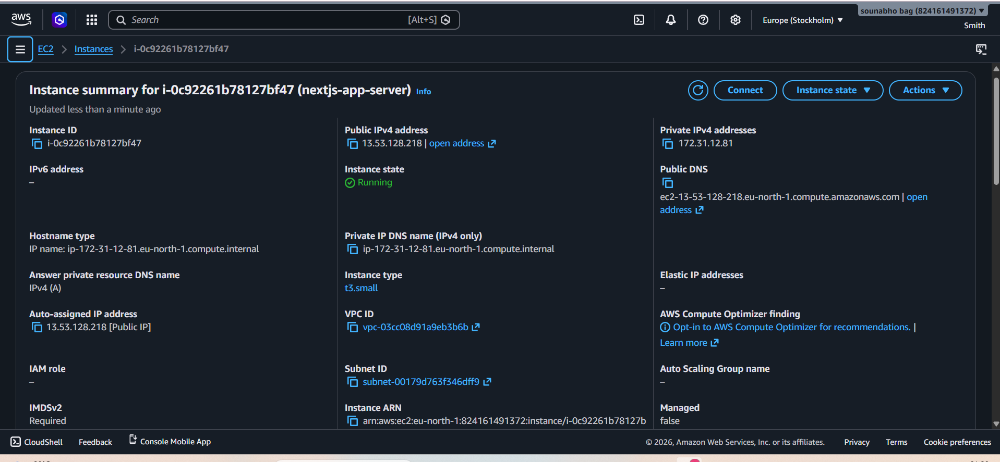
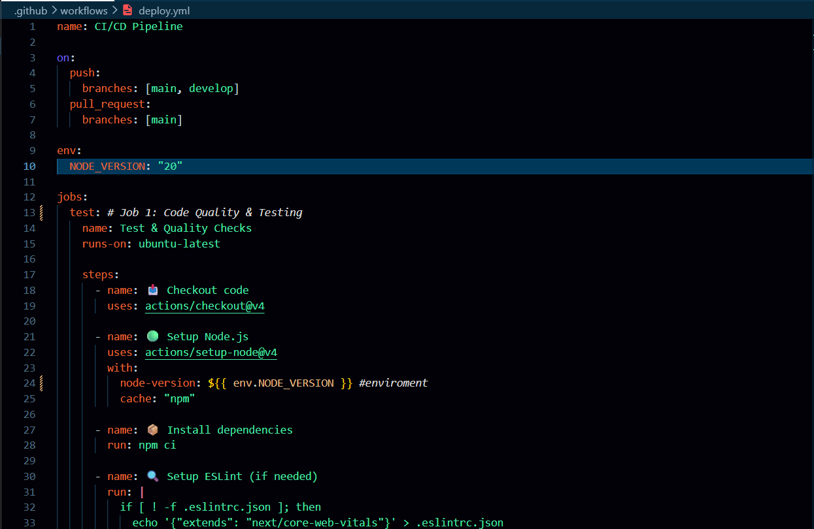
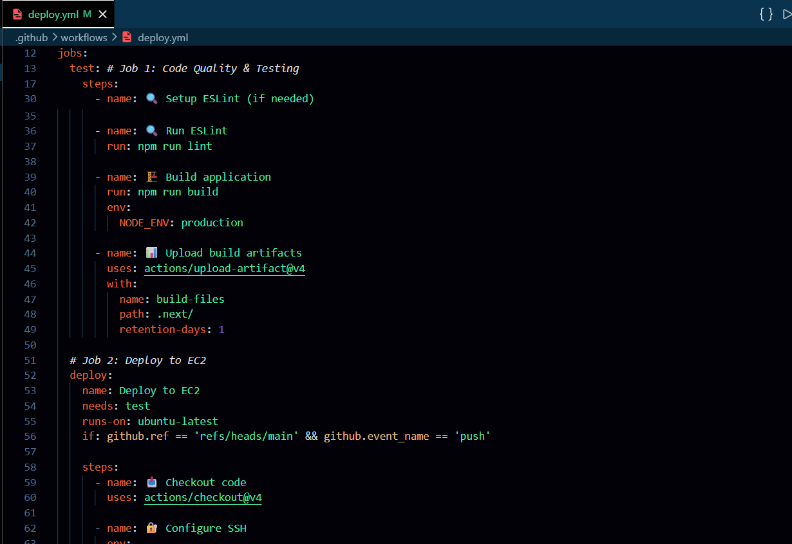
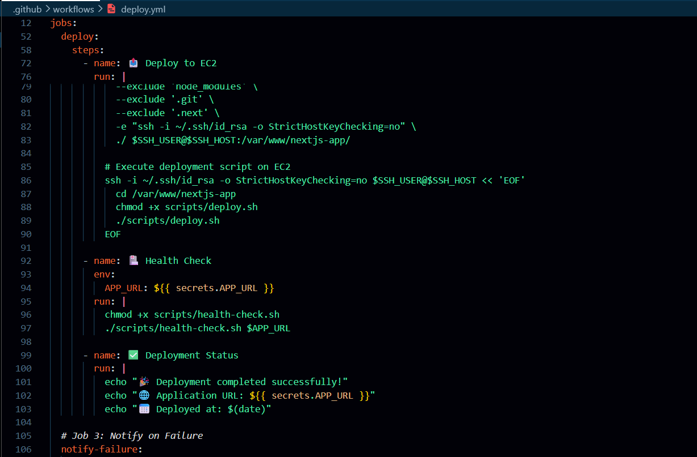

# 🚀 Next.js Authentication App with CI/CD

A production-ready Next.js application featuring JWT authentication, automated CI/CD pipelines, AWS EC2 deployment, PM2 process management, and Nginx reverse proxy configuration.


# 🚀 Next.js Authentication App with CI/CD



A production-ready Next.js application featuring JWT authentication, automated CI/CD pipelines, AWS EC2 deployment, PM2 process management, and Nginx reverse proxy configuration.
---

## 🌟 Features

### Authentication

* User Registration
* User Login
* JWT-based Authentication
* Secure Password Hashing with bcryptjs
* HTTP-only Cookie Storage
* Protected Dashboard Routes
* Logout Functionality

### Frontend

* Next.js 14 App Router
* Responsive UI
* Tailwind CSS Styling
* Client-side Form Validation
* Loading States
* Error Handling

### DevOps & Deployment

* GitHub Actions CI/CD Pipeline
* Automated Build Verification
* Automated Deployment to AWS EC2
* PM2 Process Management
* Nginx Reverse Proxy
* Health Check Endpoint
* Production Environment Configuration

---

## 🛠️ Tech Stack

### Frontend

* Next.js 14
* React
* JavaScript
* Tailwind CSS

### Backend

* Next.js API Routes
* JWT
* bcryptjs

### DevOps

* GitHub Actions
* AWS EC2
* Nginx
* PM2
* Linux (Amazon Linux)

### Version Control

* Git
* GitHub

---

## 📋 Project Architecture

```text
Developer
    ↓
Git Push
    ↓
GitHub Repository
    ↓
GitHub Actions CI/CD
    ↓
AWS EC2 Instance
    ↓
Nginx Reverse Proxy
    ↓
PM2 Process Manager
    ↓
Next.js Application
    ↓
Users
```

---

## 📂 Project Structure

```text
login-app-cicd/
├── app/
│   ├── api/
│   │   ├── auth/
│   │   │   ├── login/
│   │   │   ├── register/
│   │   │   └── logout/
│   │   └── health/
│   ├── dashboard/
│   ├── login/
│   ├── register/
│   ├── layout.js
│   └── page.js
│
├── components/
│   ├── LoginForm.jsx
│   ├── RegisterForm.jsx
│   └── Navbar.jsx
│
├── lib/
│   ├── auth.js
│   └── db.js
│
├── scripts/
│   ├── deploy.sh
│   └── health-check.sh
│
├── .github/
│   └── workflows/
│       └── deploy.yml
│
├── middleware.js
├── package.json
└── README.md
```

---

## 🔐 Authentication Flow

### Registration

```text
User
 ↓
Register Form
 ↓
POST /api/auth/register
 ↓
Password Hashing (bcrypt)
 ↓
Create User
 ↓
Generate JWT
 ↓
Store HTTP-only Cookie
 ↓
Dashboard
```

### Login

```text
User
 ↓
Login Form
 ↓
POST /api/auth/login
 ↓
Validate Password
 ↓
Generate JWT
 ↓
Store HTTP-only Cookie
 ↓
Dashboard
```

### Protected Routes

```text
Request Dashboard
 ↓
Check JWT Cookie
 ↓
Verify Token
 ↓
Allow Access
```

---

## 🚀 Local Development

### Clone Repository

```bash
git clone https://github.com/sounabh/Next.js-CICD-project.git
cd repository
```

### Install Dependencies

```bash
npm install
```

### Start Development Server

```bash
npm run dev
```

Open:

```text
http://localhost:3000
```

---

## ⚙️ Environment Variables

Create:

```text
.env.local
```

```env
JWT_SECRET=your-super-secret-key
NODE_ENV=development
```

Production:

```env
JWT_SECRET=your-production-secret
NODE_ENV=production
```

---

## 🔄 CI/CD Pipeline

### Continuous Integration

Every push triggers:

```text
Checkout Code
 ↓
Install Dependencies
 ↓
Run ESLint
 ↓
Build Application
 ↓
Verify Success
```

### Continuous Deployment

When code is pushed to main:

```text
GitHub Actions
 ↓
SSH into EC2
 ↓
Sync Files
 ↓
Install Dependencies
 ↓
Build Application
 ↓
Restart PM2
 ↓
Run Health Check
 ↓
Deployment Complete
```

---

## 🏗️ GitHub Actions Workflow

Pipeline includes:

### Test Stage

* Checkout Repository
* Setup Node.js
* Install Dependencies
* Run ESLint
* Build Verification

### Deploy Stage

* Configure SSH
* Sync Files using rsync
* Execute Deployment Script
* Health Check Validation

### Failure Notification

* Detect Pipeline Failures
* Display Deployment Status

---

## ☁️ AWS Infrastructure

### EC2 Instance

* Amazon Linux
* Node.js 20
* PM2
* Nginx

### Nginx Reverse Proxy

```nginx
server {
    listen 80;

    location / {
        proxy_pass http://localhost:3000;
        proxy_http_version 1.1;
    }
}
```

### PM2

```bash
pm2 start npm --name nextjs-app -- start
pm2 status
pm2 logs
pm2 monit
```

---

## 🏥 Health Check Endpoint

Endpoint:

```text
/api/health
```

Example:

```json
{
  "status": "ok",
  "timestamp": "2026-06-06T12:00:00Z",
  "environment": "production"
}
```

Test:

```bash
curl http://YOUR_SERVER/api/health
```

---

## 📊 Monitoring

### PM2 Status

```bash
pm2 status
```

### Logs

```bash
pm2 logs nextjs-app
```

### Monitoring Dashboard

```bash
pm2 monit
```

### Nginx Status

```bash
sudo systemctl status nginx
```

---

## 🔒 Security Features

* Password Hashing using bcryptjs
* JWT Authentication
* HTTP-only Cookies
* Environment Variables
* SSH Key Authentication
* Secure Deployment Workflow

---

## 🎯 DevOps Concepts Demonstrated

* CI/CD Pipelines
* GitHub Actions
* AWS EC2 Deployment
* Linux Administration
* PM2 Process Management
* Nginx Configuration
* SSH Authentication
* Reverse Proxy Setup
* Health Monitoring
* Automated Deployments

---

## 📸 Screenshots

## 📸 Project Gallery

| Home Page | Registration |
|------------|------------|
|  |  |

| Dashboard | PM2 Monitoring |
|------------|------------|
|  |  |

| EC2 Instance |
|------------|
|  |

| GitHub Actions Pipeline |
|------------|
|  |

| Successful Deployment |
|------------|
|  |

| CI/CD Workflow |
|------------|
|  |

---


---

## 🎓 Learning Outcomes

Through this project I learned:

* Next.js Full Stack Development
* JWT Authentication
* GitHub Actions CI/CD
* AWS EC2 Deployment
* Linux Server Administration
* Nginx Reverse Proxy Configuration
* PM2 Process Management
* SSH & Deployment Automation
* Production Deployment Best Practices

---

## 🌐 Live Application

Application URL:

```text
http://13.53.128.218/
(will be closed)
```

Health Endpoint:

```text
http://13.53.128.218/api/health
```

Repository:

```text
https://github.com/sounabh/Next.js-CICD-project
```

---

## 👨‍💻 Author

Sounabho Bag

### Skills Demonstrated

* Next.js
* React
* JavaScript
* Authentication
* AWS EC2
* GitHub Actions
* CI/CD
* PM2
* Nginx
* Linux
* DevOps

---

## ⭐ Support

If you found this project useful:

* Star the repository
* Fork the project
* Share feedback
* Connect on LinkedIn
*https://www.linkedin.com/in/sounabho/

---

## 📄 License

MIT License
